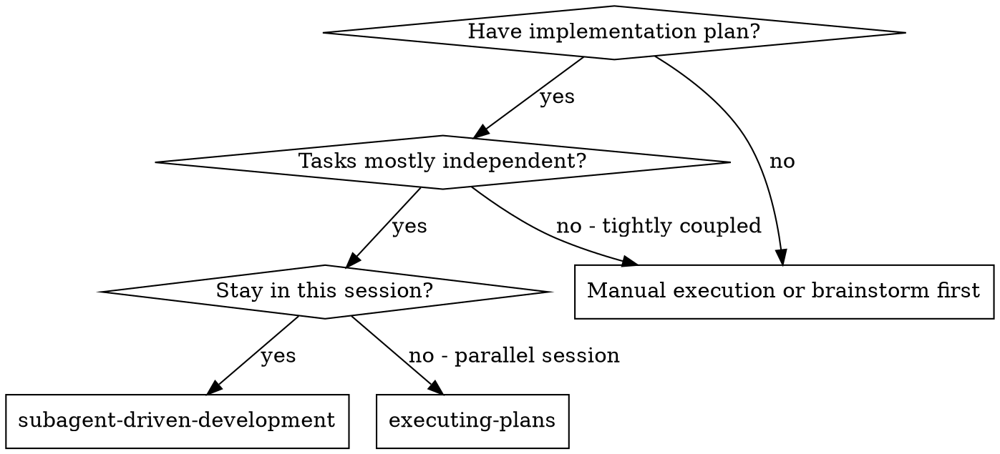
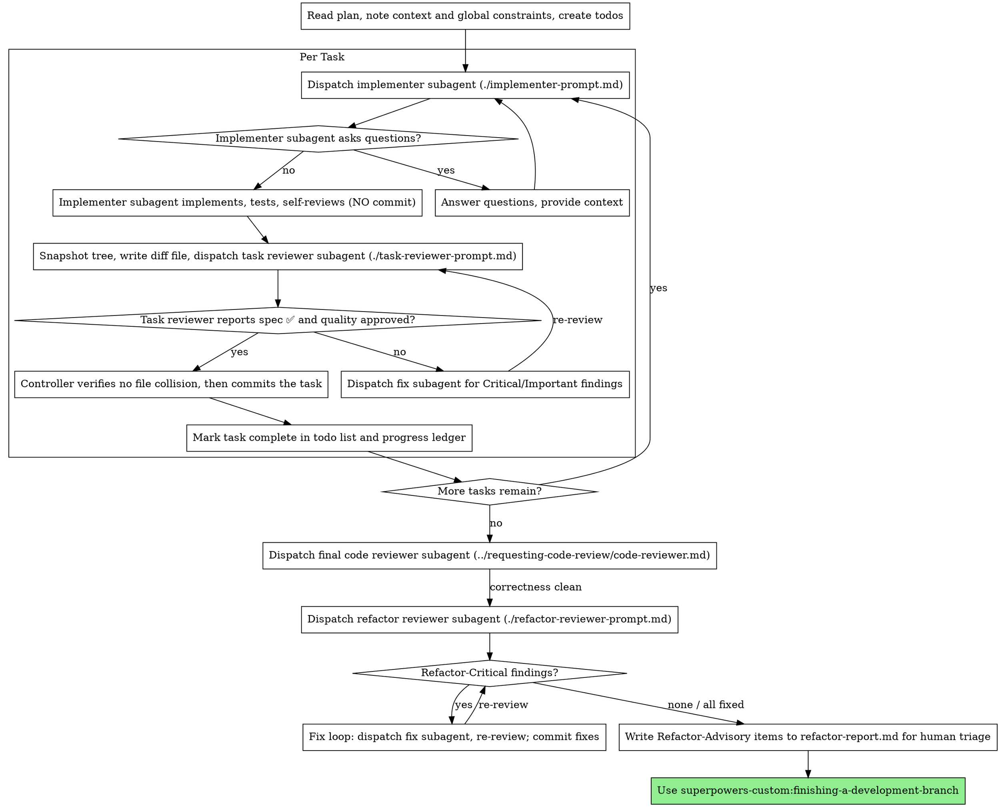

# Subagent-Driven Development

Execute plan by dispatching a fresh implementer subagent per task, a task review (spec compliance + code quality) after each, then two whole-branch passes at the end: a correctness review, then a refactor review (design lens — dead code, cross-task duplication, messy hardcodes, smells).

**Why subagents:** You delegate tasks to specialized agents with isolated context. By precisely crafting their instructions and context, you ensure they stay focused and succeed at their task. They should never inherit your session's context or history — you construct exactly what they need. This also preserves your own context for coordination work.

**Core principle:** Fresh subagent per task + task review (spec + quality) + broad final review = high quality, fast iteration

**You orchestrate; you commit.** Implementer and fix subagents NEVER commit,
push, or touch git state — they leave their work uncommitted in the working
tree. Only you commit, and only after a task's review passes and you have
confirmed its changes do not collide with other tasks. You hold the whole-run
overview; a subagent committing mid-stream would break per-task review
isolation and could entangle parallel tasks. See [Committing](#committing).

**Parallelisation.** Tasks run as concurrent subagents in the one shared
feature worktree — no extra worktree per subagent. Which tasks batch together
is computed by `scripts/plan-batches`, not decided by you (see
[Pre-Flight Plan Review](#pre-flight-plan-review)). To dispatch a batch, use
superpowers-custom:dispatching-parallel-agents and launch every task in the
batch **in the background (non-blocking) in a single message** — a blocking
dispatch serializes them and defeats the point. When the batch returns, review
and commit each task per its own files ([Committing](#committing)).

**Narration:** between tool calls, narrate at most one short line — the
ledger and the tool results carry the record.

**Continuous execution:** Do not pause to check in with your human partner between tasks. Execute all tasks from the plan without stopping. The only reasons to stop are: BLOCKED status you cannot resolve, ambiguity that genuinely prevents progress, or all tasks complete. "Should I continue?" prompts and progress summaries waste their time — they asked you to execute the plan, so execute it.

## When to Use



**vs. Executing Plans (parallel session):**
- Same session (no context switch)
- Fresh subagent per task (no context pollution)
- Review after each task (spec compliance + code quality), broad review at the end
- Faster iteration (no human-in-loop between tasks)

## The Process



## Pre-Flight Plan Review

Before dispatching Task 1, scan the plan once. This scan has two required
outputs — a conflict list AND a batch plan. Do both before any dispatch.

**1. Conflict scan.** Look for:

- tasks that contradict each other or the plan's Global Constraints
- anything the plan explicitly mandates that the review rubric treats as a
  defect (a test that asserts nothing, verbatim duplication of a logic block)

Present everything you find to your human partner as one batched question —
each finding beside the plan text that mandates it, asking which governs —
before execution begins, not one interrupt per discovery mid-plan. If the
scan is clean, proceed without comment. The review loop remains the net for
conflicts that only emerge from implementation.

**2. Batch plan (mandatory — the script computes it, not you).** You do NOT
decide batching by judgment. You DECLARE each task's files and dependencies in
a file; `scripts/plan-batches` computes the execution order deterministically.
This exists because the one judgement controllers reliably get wrong is
calling two tasks dependent because they are thematically "related" ("this
file changes something related to that one, so let's wait") — a phantom edge
that serializes work that could run in parallel. The script removes that
discretion: it honours only edges that name a real produced/consumed symbol,
and it does the layering so you cannot fall back to "all sequential to be
safe."

A dependency edge exists between two tasks ONLY when both are true; the script
enforces the second:

- **Disjoint files** — their file sets do not overlap (a write collision, not
  a dependency — the script splits same-layer file-overlapping tasks into
  separate batches automatically).
- **Real produce/consume** — task B depends on task A only when B's code
  references a concrete symbol, interface, signature, schema, constant, route,
  or contract that A creates or changes. A shared theme is NOT a dependency.
  If you cannot name the symbol B consumes, there is no edge — the tasks are
  independent.

**Procedure:**

1. Write `.superpowers/sdd/deps.txt` — one stanza per task: its `task:` id, the
   `files:` it writes, and a `needs:` line per real dependency naming the
   consumed symbol (`needs: task-1 consumes=parseToken`). The format and rules
   are documented at the top of `scripts/plan-batches`. Declare an edge ONLY
   with a nameable symbol; when in doubt, leave it out and let the file-collision
   split and the per-task review catch a genuine conflict.
2. Run `scripts/plan-batches` (defaults to that path). It prints the batch plan,
   or exits non-zero naming a specific problem: a `needs:` with no
   `consumes=`, a vague `consumes=` ("related", "similar", "theme", …), a
   dangling edge, a dependency cycle, or a task with no files. Each of those is
   a plan gap — fix the declaration (or the plan), do not work around it by
   serializing.
3. Copy the printed batch plan into the progress ledger. That is the execution
   order: dispatch each batch's tasks concurrently in the background, run
   batches in order. A batch of one task is a computed result, not a default.

If you cannot derive a task's file set or its real dependencies from the plan,
that is a plan gap: resolve it before execution, not by falling back to
sequential.

**Worked example.** A 4-task plan. Task 2 calls a function Task 1 writes; Task
4 uses a constant Task 1 defines; Task 3 shares no symbol with anyone but
writes a file Task 1 also touches. You write:

```
task: task-1
files: src/auth.py

task: task-2
files: src/handler.py
needs: task-1 consumes=parseToken

task: task-3
files: src/auth.py

task: task-4
files: src/config_check.py
needs: task-1 consumes=AUTH_TIMEOUT
```

Run `scripts/plan-batches` → it prints:

```
batch 1 (single): task-1
batch 2 (single): task-3
batch 3 (parallel): task-2, task-4

file-collision splits (same layer, overlapping files):
  task-3 and task-1 both write src/auth.py — split into separate batches
```

Read what the script did that you would have gotten wrong by hand: task-2 and
task-4 both depend on task-1 but NOT on each other — no shared symbol — so they
run **concurrently** in batch 3. A cautious controller would have serialized
all four. task-3 has no dependency at all, yet it can't join task-1's batch
because they write the same file, so it lands in its own batch (2). And no edge
says `consumes=auth` or `consumes=related` — every edge names the actual
symbol, or it is not an edge.

## Model Selection

**Default for step-based plans: Sonnet implementers.** When the plan is a
well-specified, step-by-step plan, dispatch every implementer subagent on
Sonnet (`claude-sonnet-4-6`) — the steps carry the design, so implementation
is execution, not architecture. Do not escalate the implementer to a more
capable model just because a step looks involved.

**Call the advisor only when the plan itself has an issue.** The "advisor" is
a one-shot dispatch to the most capable available model, used to resolve a
defect in the plan — a step that is ambiguous, internally contradictory,
under-specified, or that an implementer hit as BLOCKED for a design reason
(not a context reason). Ask the advisor the specific plan question, fold its
answer back into the plan/brief, then continue on Sonnet. Routine
implementation never calls the advisor. The final whole-branch review is the
other most-capable dispatch (see below).

Beyond that default, use the least powerful model that can handle each role.
Pick by what the task actually demands:

- **Cheapest tier** — the plan text contains the complete code (transcription
  + testing), or a single-file mechanical fix. Touches 1-2 files, complete spec.
- **Standard/mid tier** — integration and judgment: multi-file coordination,
  pattern matching, debugging, or an implementer working from prose. This is
  also the floor for reviewers.
- **Most capable** — architecture and design judgment, or broad codebase
  understanding. The final correctness review AND the refactor review are both
  this tier. Reviews scale with the diff: a subtle concurrency change needs it,
  a small mechanical diff does not.

**Turn count beats token price.** The cheapest models routinely take 2-3× the
turns on multi-step work, costing more overall — hence the mid-tier floor for
reviewers and prose-fed implementers.

**Always specify the model explicitly when dispatching.** An omitted model
inherits your session's model — often the most capable and expensive — which
silently defeats this section.

## Handling Implementer Status

Implementer subagents report one of four statuses. Handle each appropriately:

**DONE:** The implementer left its work uncommitted in the working tree. Capture it and review it:
1. `AFTER=$(scripts/snapshot)` — tree SHA of the working tree now.
2. `BASE` is the tree before this task: `HEAD^{tree}` for a sequential task, or the snapshot you recorded before dispatching a parallel batch.
3. `scripts/review-package "$BASE" "$AFTER"` (add `-- <this task's files>` when the task is one of a parallel batch) — it prints the unique diff path.
4. Dispatch the task reviewer with the printed path. Do NOT commit yet — you commit only after the review passes (see [Committing](#committing)).

**DONE_WITH_CONCERNS:** The implementer completed the work but flagged doubts. Read the concerns before proceeding. If the concerns are about correctness or scope, address them before review. If they're observations (e.g., "this file is getting large"), note them and proceed to review.

**NEEDS_CONTEXT:** The implementer needs information that wasn't provided. Provide the missing context and re-dispatch.

**BLOCKED:** The implementer cannot complete the task. Assess the blocker:
1. If it's a context problem, provide more context and re-dispatch with the same model
2. If the task requires more reasoning, re-dispatch with a more capable model
3. If the task is too large, break it into smaller pieces
4. If the plan itself is wrong, escalate to the human

**Never** ignore an escalation or force the same model to retry without changes. If the implementer said it's stuck, something needs to change.

## Handling Reviewer ⚠️ Items

The task reviewer may report "⚠️ Cannot verify from diff" items — requirements
that live in unchanged code or span tasks. These do not block the rest of the
review, but you must resolve each one yourself before marking the task
complete: you hold the plan and cross-task context the reviewer
lacks. If you confirm an item is a real gap, treat it as a failed spec
review — send it back to the implementer and re-review.

## Constructing Reviewer Prompts

Per-task reviews are task-scoped gates. The broad review happens once, at the
final whole-branch review. When you fill a reviewer template:

- Do not add open-ended directives like "check all uses" or "run race tests
  if useful" without a concrete, task-specific reason
- Do not ask a reviewer to re-run tests the implementer already ran on the
  same code — the implementer's report carries the test evidence
- Do not pre-judge findings for the reviewer — never instruct a reviewer to
  ignore or not flag a specific issue. If you believe a finding would be a
  false positive, let the reviewer raise it and adjudicate it in the review
  loop. If the prompt you are writing contains "do not flag," "don't treat X
  as a defect," "at most Minor," or "the plan chose" — stop: you are
  pre-judging, usually to spare yourself a review loop.
- The global-constraints block you hand the reviewer is its attention
  lens. Copy the binding requirements verbatim from the plan's Global
  Constraints section or the spec: exact values, exact formats, and the
  stated relationships between components ("same layout as X", "matches
  Y"). The reviewer's template already carries the process rules (YAGNI,
  test hygiene, review method) — the constraints block is for what THIS
  project's spec demands.
- Hand the reviewer its diff as a file — the `scripts/review-package` path
  from [Handling Implementer Status](#handling-implementer-status), never
  pasted into your own context. The package has no commit list (the work is
  uncommitted) — that is expected. Without bash: `git diff --stat BASE AFTER`
  and `git diff -U10 BASE AFTER` redirected to one uniquely named file.
- A dispatch prompt describes one task, not the session's history. Do not
  paste accumulated prior-task summaries ("state after Tasks 1-3") into
  later dispatches — a real session's dispatch hit 42k chars of which 99%
  was pasted history. A fresh subagent needs its task, the interfaces it
  touches, and the global constraints. Nothing else.
- Dispatch fix subagents for Critical and Important findings. Record Minor
  findings in the progress ledger as you go, and point the final
  whole-branch review at that list so it can triage which must be fixed
  before merge. A roll-up nobody reads is a silent discard.
- A finding labeled plan-mandated — or any finding that conflicts with
  what the plan's text requires — is the human's decision, like any plan
  contradiction: present the finding and the plan text, ask which governs.
  Do not dismiss the finding because the plan mandates it, and do not
  dispatch a fix that contradicts the plan without asking.
- The final whole-branch review gets a package too: run
  `scripts/review-package MERGE_BASE HEAD` (MERGE_BASE = the commit the
  branch started from, e.g. `git merge-base main HEAD`) and include the
  printed path in the final review dispatch, so the final reviewer reads
  one file instead of re-deriving the branch diff with git commands.
- Every fix dispatch carries the implementer contract: the fix subagent
  re-runs the tests covering its change and reports the results. Name the
  covering test files in the dispatch — a one-line fix does not need the
  whole suite. Before re-dispatching the reviewer, confirm the fix report
  contains the covering tests, the command run, and the output; dispatch
  the re-review once all three are present.
- If the final whole-branch review returns findings, dispatch ONE fix
  subagent with the complete findings list — not one fixer per finding.
  Per-finding fixers each rebuild context and re-run suites; a real
  session's final-review fix wave cost more than all its tasks combined.

## Refactor Review (whole-branch, final gate)

After the final correctness review comes back clean, dispatch one more
whole-branch pass: the **refactor reviewer** (./refactor-reviewer-prompt.md).
It is a different lens from every review before it. The per-task reviewer and
the final correctness reviewer answer "does it work / match spec." This one
answers "now that it works, is it well-shaped, or should something be
refactored before merge" — design smells, cross-task duplication, messy
hardcodes, dead code, missing or leaky abstractions.

**Why it must be whole-branch and late.** These are properties of the
assembled branch, not of any one task's diff. A symbol added in Task 1 and
consumed in Task 5 looks dead in Task 1's scoped review; duplication between
two tasks is invisible until both land; a hardcode is only "messy" relative
to a constant another task defined. Independent task subagents never saw each
other's code, so they reinvent helpers and constants — only a pass over the
whole branch catches it. Unlike the per-task reviewer, this reviewer MAY read
the whole codebase (it must, to grep every new symbol for a real consumer).

**Hybrid by severity — two buckets, two fates:**

- **Refactor-Critical (mechanical, auto-fix).** Objectively verifiable and
  evidence-backed: dead code (grep shows zero real consumers), exact/near-exact
  duplication (both ranges cited), a hardcode that duplicates an existing named
  constant (both locations cited). Handle these exactly like task-review
  findings — dispatch ONE fix subagent with the complete Critical list, the
  fix carries the implementer contract (re-run covering tests, report results),
  then re-run the refactor package and re-review the Critical bucket. Commit
  the fixes yourself. A Critical finding that arrives without its evidence is
  downgraded to Advisory — do not auto-fix it.
- **Refactor-Advisory (design opinion, human triage).** Judgment calls where
  engineers reasonably differ — "could extract," a God-function forming,
  primitive obsession, naming drift, a shape that will bite later. Do NOT
  auto-fix these — auto-rewriting working, tested code on an opinion is churn.
  Write them to `.superpowers/sdd/refactor-report.md` and carry them into
  superpowers-custom:finishing-a-development-branch, where the human triages
  each: fix now, ticket, or accept. A roll-up nobody reads is a silent discard.

A clean branch with zero findings is a valid, expected result — this reviewer
does not manufacture refactors, and YAGNI makes a speculative abstraction a
smell, not a fix. Dispatch it on the most capable available model (design
judgment, same tier as the final correctness review), and reuse the same
branch package the final review used (`scripts/review-package MERGE_BASE HEAD`)
rather than regenerating it.

## File Handoffs

Everything you paste into a dispatch prompt — and everything a subagent
prints back — stays resident in your context for the rest of the session
and is re-read on every later turn. Hand artifacts over as files:

- **Task brief:** before dispatching an implementer, run this skill's
  `scripts/task-brief PLAN_FILE N` — it extracts the task's full text to a
  uniquely named file and prints the path. Compose the dispatch so the
  brief stays the single source of requirements. Your dispatch should
  contain: (1) one line on where this task fits in the project; (2) the
  brief path, introduced as "read this first — it is your requirements,
  with the exact values to use verbatim"; (3) interfaces and decisions
  from earlier tasks that the brief cannot know; (4) your resolution of
  any ambiguity you noticed in the brief; (5) the report-file path and
  report contract. Exact values (numbers, magic strings, signatures, test
  cases) appear only in the brief.
- **Report file:** name the implementer's report file after the brief
  (brief `…/task-N-brief.md` → report `…/task-N-report.md`) and put it in
  the dispatch prompt. The implementer writes the full report there and
  returns only status, files changed (it does not commit), a one-line test
  summary, and concerns.
- **Reviewer inputs:** the task reviewer gets three paths — the same brief
  file, the report file, and the review package — plus the global
  constraints that bind the task.
- Fix dispatches append their fix report (with test results) to the same
  report file and return a short summary; re-reviews read the updated file.

## Committing

Implementer and fix subagents never commit — you do, and only here. For each
task, after its review verdict is clean:

1. **Verify no collision.** Confirm the task touched only the files it was
   meant to (compare the implementer's reported file list against
   `git diff --name-only HEAD`). For a parallel batch, confirm no two tasks
   wrote the same file. If a collision exists, do not commit — reconcile it
   (re-dispatch the loser sequentially, or merge by hand) first.
2. **Commit the task yourself**, with a message describing the task. In a
   parallel batch, commit each task separately (stage only that task's files:
   `git add -- <task files> && git commit -m "..."`) so history stays
   one-commit-per-task and the ledger can name a single SHA.
3. **Record the SHA** in the progress ledger (see Durable Progress).

After a sequential task's commit the working tree is clean again, so the next
task's BASE is simply `HEAD^{tree}`. Never let a subagent commit on your
behalf; never push until the whole branch is done and you reach
superpowers-custom:finishing-a-development-branch.

## Durable Progress

Conversation memory does not survive compaction. In real sessions,
controllers that lost their place have re-dispatched entire completed task
sequences — the single most expensive failure observed. Track progress in
a ledger file, not only in todos.

- At skill start, check for a ledger:
  `cat "$(git rev-parse --show-toplevel)/.superpowers/sdd/progress.md"`. Tasks listed there
  as complete are DONE — do not re-dispatch them; resume at the first task
  not marked complete.
- When a task's review comes back clean AND you have committed it (you, the
  controller — not the subagent), append one line to the ledger in the same
  message as your other bookkeeping:
  `Task N: complete (commit <sha7>, review clean)`.
- The ledger is your recovery map: the commits it names exist in git even
  when your context no longer remembers creating them. After compaction,
  trust the ledger and `git log` over your own recollection.
- `git clean -fdx` will destroy the ledger (it's git-ignored scratch); if
  that happens, recover from `git log`.

## Prompt Templates

- [implementer-prompt.md](implementer-prompt.md) - Dispatch implementer subagent
- [task-reviewer-prompt.md](task-reviewer-prompt.md) - Dispatch task reviewer subagent (spec compliance + code quality)
- Final whole-branch review: use superpowers-custom:requesting-code-review's [code-reviewer.md](../requesting-code-review/code-reviewer.md)
- [refactor-reviewer-prompt.md](refactor-reviewer-prompt.md) - Dispatch whole-branch refactor reviewer (design lens: dead code, duplication, hardcodes, smells) after the final correctness review is clean

## Example Workflow

```
You: I'm using Subagent-Driven Development to execute this plan.

[Read plan file once: docs/superpowers/plans/feature-plan.md]
[Create todos for all tasks]

Task 1: Hook installation script

[Run task-brief for Task 1; dispatch implementer with brief + report paths + context]

Implementer: "Before I begin - should the hook be installed at user or system level?"

You: "User level (~/.config/superpowers/hooks/)"

Implementer: "Got it. Implementing now..."
[Later] Implementer:
  - Implemented install-hook command
  - Added tests, 5/5 passing
  - Self-review: Found I missed --force flag, added it
  - Files changed: install-hook.sh, install-hook.test.sh (left uncommitted)

[Snapshot tree, run review-package BASE AFTER, dispatch task reviewer with the printed path]
Task reviewer: Spec ✅ - all requirements met, nothing extra.
  Strengths: Good test coverage, clean. Issues: None. Task quality: Approved.

[Verify only the task's files changed, then YOU commit the task]
[Mark Task 1 complete with the commit SHA]

Task 2: Recovery modes

[Run task-brief for Task 2; dispatch implementer with brief + report paths + context]

Implementer: [No questions, proceeds]
Implementer:
  - Added verify/repair modes
  - 8/8 tests passing
  - Self-review: All good
  - Files changed: recovery.sh (left uncommitted)

[Run review-package, dispatch task reviewer with the printed path]
Task reviewer: Spec ❌:
  - Missing: Progress reporting (spec says "report every 100 items")
  - Extra: Added --json flag (not requested)
  Issues (Important): Magic number (100)

[Dispatch fix subagent with all findings]
Fixer: Removed --json flag, added progress reporting, extracted PROGRESS_INTERVAL constant

[Task reviewer reviews again]
Task reviewer: Spec ✅. Task quality: Approved.

[Mark Task 2 complete]

...

[After all tasks]
[Dispatch final code-reviewer]
Final reviewer: All requirements met, ready to merge

[Correctness clean — dispatch refactor reviewer with the same branch package]
Refactor reviewer:
  Well-shaped: config loader, error types
  Refactor-Critical: parseTimeout() in retry.ts:40 duplicates parseDuration()
    in util.ts:12 (both ranges cited); MAX_RETRIES literal 5 in retry.ts:8
    duplicates existing RETRY_LIMIT in config.ts:20
  Refactor-Advisory: Task 3's Handler is growing into a God-object — consider
    splitting transport from routing
  Refactor before merge? Critical fixes only

[Dispatch one fix subagent with both Critical findings; fixer re-runs covering
 tests; re-review Critical bucket → clean; commit fixes]
[Write the advisory God-object note to .superpowers/sdd/refactor-report.md]

Done! (carry refactor-report.md into finishing-a-development-branch)
```

## Red Flags

Never (each expanded in the section named):
- Start implementation on main/master without explicit user consent
- Let an implementer or fix subagent commit, push, or touch git state — only
  you commit, after review passes ([Committing](#committing))
- Commit a task before its review is clean, or before verifying no file
  collision ([Committing](#committing))
- Skip task review, or accept a report missing either verdict — spec
  compliance AND task quality are both required; move on with open
  Critical/Important issues
- Let implementer self-review replace actual review (both needed)
- Dispatch parallel subagents that are not BOTH file-disjoint AND independent,
  or declare a `needs:` edge on a theme instead of a nameable produced/consumed
  symbol ([Pre-Flight](#pre-flight-plan-review))
- Default to sequential without running `scripts/plan-batches` — dispatch the
  batches it computes, don't decide parallelism reactively
- Tell a reviewer what not to flag or pre-rate a finding's severity
  ([Constructing Reviewer Prompts](#constructing-reviewer-prompts))
- Dispatch a task reviewer without a diff file — generate it first
  (`scripts/review-package BASE AFTER`)
- Make a subagent read the whole plan file — hand it a `scripts/task-brief`;
  skip the scene-setting context that says where the task fits
- Ignore subagent questions — answer before they proceed
- Re-dispatch a task the ledger already marks complete — check the ledger and
  `git log` after any compaction ([Durable Progress](#durable-progress))
- Finish the branch without the whole-branch refactor review after correctness
  ([Refactor Review](#refactor-review-whole-branch-final-gate))
- Auto-fix a Refactor-Advisory finding, or a Refactor-Critical one lacking its
  evidence; or drop the advisory items instead of writing them to
  `.superpowers/sdd/refactor-report.md`

## Integration

**Required workflow skills:**
- **superpowers-custom:using-git-worktrees** - Ensures isolated workspace (creates one or verifies existing)
- **superpowers-custom:writing-plans** - Creates the plan this skill executes
- **superpowers-custom:requesting-code-review** - Code review template for the final whole-branch review
- **superpowers-custom:finishing-a-development-branch** - Complete development after all tasks

**Subagents should use:**
- **superpowers-custom:test-driven-development** - Subagents follow TDD for each task

**Alternative workflow:**
- **superpowers-custom:executing-plans** - Use for parallel session instead of same-session execution
